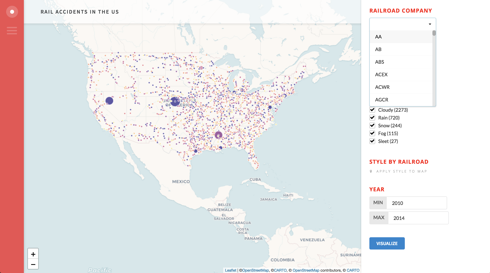

# Isthmus JS



A simple Javascript library to rapidly develop geospatial applications with CARTO.js and Semantic UI. Easily create:

- Data driven dropdowns
- Data driven checkbox lists
- Layer controls
- Mix/max ranges
- Menus and data exports (including batch exports)
- Autostyle controls
- Simple inputs

And more. 

# Getting Started

Make sure you include the following libraries in your code:

- [CARTO.js](https://carto.com/documentation/cartojs/) 
- [Semantic UI](https://semantic-ui.com/) 
- [jQuery](https://developers.google.com/speed/libraries/#jquery)

You can use the `rail.html` file as a sample to get started.

# Quick Docs

After creating your layers, queries, and styles from CARTO.js, particularly the layer you want your widgets to interact with. For example:

```javascript
var myQuery = new carto.source.SQL(query)
```

## Credentials

First, add your credentials so you can use these to inform your widgets:

```javascript
var creds = new accountCreds({
  apiKey: 'carto-apikey',
  username: 'carto-username',
  map: map
})
```

## Dropdown

```javascript
var drop = new newDropdown({
  credentials: creds,
  id: 'div_id',
  max: 5,
  query: myQuery,
  column: 'column_name',
  table: 'table_name',
  title: 'WIDGET TITLE'
})
```

- max: Max number of entries you want to be selectable
- id: Unique div id for the dropdown

## Checkbox List

```javascript
var checklist = newCheckboxList({
  credentials: creds,
  title: 'WIDGET TITLE',
  name: 'div_id',
  query: myQuery,
  dataset: 'table_name',
  column: 'column_name',
  aggregation: 'count'
})
```

## Range Input

```javascript
var range = rangeInput({
  title: 'WIDGET TITLE',
  credentials: creds,
  name: 'div_id',
	column: 'column_name',
	query: myQuery
})
```

## Checkbox (Layer Control)

```javascript
var layer = new newCheckbox({
  layer: layerName,
  name: 'div_id',
  credentials: creds,
  label: 'Checkbox Label',
  title: 'WIDGET TITLE',
  checked: false
})
```

## Simple Input (In Development)

```javascript
var input = newInput({
  title: 'WIDGET TITLE',
  name: 'div_id',
  placeholder: 'Placeholder Text',
  min: 0,
  max: 100,
  start: 10
})
```

## Auto Style

```javascript
var style = new autoStyle({
  column: 'column_name',
  layer: myLayer,
  id: 'div_id',
  title: 'WIDGET TITLE',
  cartocss: `#layer {
          marker-width: 10;
          marker-fill: red;
          marker-fill-opacity: 1;
          marker-allow-overlap: true;
          marker-line-width: 1;
          marker-line-color: #FFFFFF;
          marker-line-opacity: 1;
          }`,
  defaultCartocss: myStyle
})
```

## Info Panel

Control to add a custom slide out panel when clicking a map element.
```javascript
myLayer.on(carto.layer.events.FEATURE_CLICKED, d => {

var sidebar = new sidebarInfo({
  layer: myLayer,
  content: `<h1> ${d.data.column_name} </h1>
    <h2>TITLE TEXT</h2>
    <p> ${d.data.column_name} </p>
    <h2>TITLE TEXT</h2>
    <p> ${d.data.column_name} </p>
    `
});
});
```

## File Export

```javascript
var export = fileExport({
 filename: "Filename",
 credentials: creds,
 query: myQuery,
 format: "CSV"
})
```

## Batch Export

```javascript
var batchexport = batchExport({
	name: "WIDGET TITLE",
	description: "Text space to describe what this export will do",
	credentials: creds,
	query: myQuery,
	filename: "new_table_title",
	format: "CSV"
})
```

## Query Assembly

Currently, the map works by triggering a click event on a button to restyle the map and update all the existing widgets. This happens in the following code. To create the text needed for the query there are three functions:

- Text Query: Creates a string for a text query such as `state IN ('WI', 'MN', 'IL')`
- Range Query: Creates a string for ranges such as `year BETWEEN 2012 AND 2016`
- Query Factory: Takes an array of query elements and assembles them into a final query which will update the map and widgets: `SELECT * FROM table_name WHERE state IN ('WI', 'MN', 'IL') AND year BETWEEN 2012 AND 2016`

Below is a complete example of this implementation:

```javascript
$("#button").mousedown(function () {

//Below is an example for a checkbox list - variable is the var name you assigned the checkbox list to

var checkboxes = textQuery({
    variable: checklist,
    column: "column_name"
  });

//Below is an example for a checkbox list - variable is the var name you assigned the checkbox list to

var range = rangeQuery({
    name: 'range',
    column: 'year'
});

var dropdown = textQuery({
    variable: drop,
    column: "school",
    dropdown: true,
    name: "test"
  });

var queryFinal = queryFactory({
  table: 'table_name',
  items: [checkboxes, range, dropdown]
})

myQuery.setQuery(queryFinal);

//console.log(queryFinal)

});
```

# Coming Soon

- Pie Chart Widget
- Time Series Widget
- Complete text input functionality
- Style controls for elements in the maps (hovers, pop ups)
- Add auto style controls to relevant widgets
- Legends
- Freeform search
- Stacked info window tool (for multiple items at the same geometry location)
- Lasso tool
- Complete CSS Library
- Examples
- Options to modify the SELECT * FROM part of the query to do more in the map selections (for groupings and aggregations)
- Improvements to generating SQL statements in the widget
- Widget subtitles and descriptions

## Contributions

Are welcome. Or open an issue.